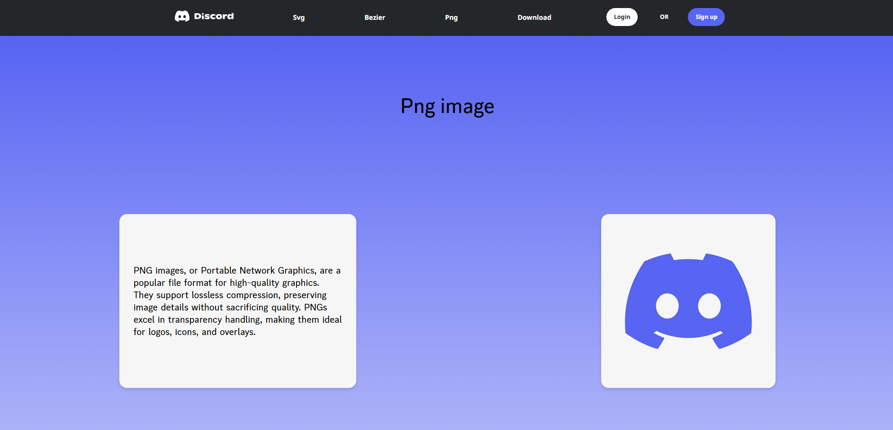

DiscordLogo je moj drugi izdelek. Uporabljen je css, html in javascript. Html je uporabljen za strukturo dokumenta, css je za oblikovanje, barvanje, odmik itd. Javascript sem uporabil predvsem za animacije in klicanje funkcij.

Imam uvodno stran:

Svg slika:

Bezier slika:

Png slika:

Download:

